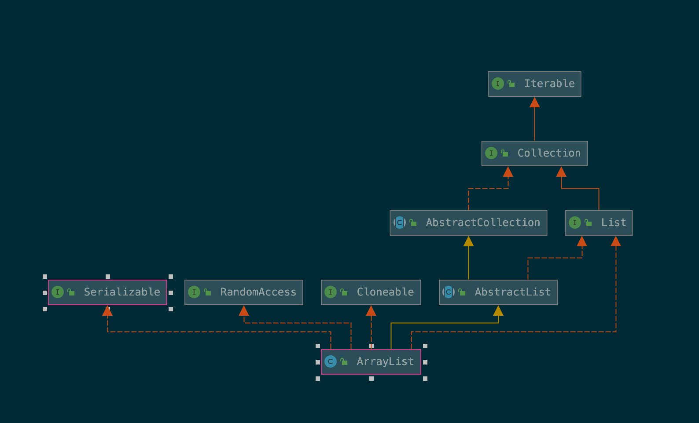

# ArrayList

# 1. ArrayList 简介



```java
public class ArrayList<E> extends AbstractList<E>
        implements List<E>, RandomAccess, Cloneable, java.io.Serializable
```


#  2. ArrayList扩容机制分析

### 2.1 先从ArrayList的构造函数说起

细心的小伙伴应该已经发现了，不论是默认构造函数还是带有`initialCapacity`参数的构造函数，构造完仍然是空数组且是共享单例，JDK 8使用了''懒汉式''单例设计模式（而JDK 7的无参构造函数则直接创建了长度为10的`Object[]`数组 ，饿汉式）直到调用`add`添加元素时才正式扩容为10或者`initialCapacity`。

```java
    /**
     * Default initial capacity.
     */
    private static final int DEFAULT_CAPACITY = 10;

		// EMPTY_ELEMENTDATA和DEFAULTCAPACITY_EMPTY_ELEMENTDATA的区别在于，DEFAULT_CAPACITY_ELEMENTDATA是由默认构造函数构造的空数组，而EMPTY_ELEMENTDATA是由`public ArrayList(int initialCapacoty)`构造的。区分它们主要是为了后面扩容可以区分这两者，如果是默认构造函数构造的空数组，那么它的Capacity应当是10.
    /**
     * Shared empty array instance used for empty instances.
     */
    private static final Object[] EMPTY_ELEMENTDATA = {};

    /**
     * Shared empty array instance used for default sized empty instances. We
     * distinguish this from EMPTY_ELEMENTDATA to know how much to inflate when
     * first element is added.
     */
    private static final Object[] DEFAULTCAPACITY_EMPTY_ELEMENTDATA = {};

    /**
     * The array buffer into which the elements of the ArrayList are stored.
     * The capacity of the ArrayList is the length of this array buffer. Any
     * empty ArrayList with elementData == DEFAULTCAPACITY_EMPTY_ELEMENTDATA
     * will be expanded to DEFAULT_CAPACITY when the first element is added.
     */
    transient Object[] elementData; // non-private to simplify nested class access

    /**
     * The size of the ArrayList (the number of elements it contains).
     *
     * @serial
     */
    private int size;

    /**
     * Constructs an empty list with the specified initial capacity.
     *
     * @param  initialCapacity  the initial capacity of the list
     * @throws IllegalArgumentException if the specified initial capacity
     *         is negative
     */
    public ArrayList(int initialCapacity) {
        if (initialCapacity > 0) {
            this.elementData = new Object[initialCapacity];
        } else if (initialCapacity == 0) {
            this.elementData = EMPTY_ELEMENTDATA;
        } else {
            throw new IllegalArgumentException("Illegal Capacity: "+
                                               initialCapacity);
        }
    }

    /**
     * Constructs an empty list with an initial capacity of ten.
     */
    public ArrayList() {
        this.elementData = DEFAULTCAPACITY_EMPTY_ELEMENTDATA;
    }

    /**
     * Constructs a list containing the elements of the specified
     * collection, in the order they are returned by the collection's
     * iterator.
     *
     * @param c the collection whose elements are to be placed into this list
     * @throws NullPointerException if the specified collection is null
     */
    public ArrayList(Collection<? extends E> c) {
        elementData = c.toArray();
        if ((size = elementData.length) != 0) {
            // c.toArray might (incorrectly) not return Object[] (see 6260652)
            if (elementData.getClass() != Object[].class)
                elementData = Arrays.copyOf(elementData, size, Object[].class);
        } else {
            // replace with empty array.
            this.elementData = EMPTY_ELEMENTDATA;
        }
    }
```


下面不妨从一个调用无参构造函数开始，如下所示：

```java
List<Integer> arrayList = new ArrayList<>();
arrayList.add(1);
arrayList.add(2);
...
arrayList.add(10); // 如上所示一直添加到第10个元素
arrayList.add(11);
...
```

我们第一行`List<Integer> arrayList = new ArrayList<>();`调用了无参构造函数，此时arrayList内部的`elementdata`指向共享的默认容量的空数组实例`DEFAULTCAPACITY_EMPTY_ELEMENTDATA`，`size`等于0（因为空数组），但容量为10。

### 2.2 继续分析扩容机制

#### 2.2.1 add方法

`add(E e)`方法将元素`e`直接附在最后。首先调用`ensureCapacityInternal()`方法确保容量不会小于`size+1`，保证有足够的容量添加元素，然后可以看到`add(e)`实质就是`Object`数组直接赋值。

至于`add(int index, E element)`方法，首先做索引检查，因为是添加元素所以合法的索引范围是`[0, size+1]`。然后同样调用`ensureCapacityInternal()`方法，然后这里利用`System.arraycopy()`方法将索引为`[index, size-1]`范围内的元素全部向后移动1位，然后再赋值，`size++`。

```java
/**
     * Appends the specified element to the end of this list.
     *
     * @param e element to be appended to this list
     * @return <tt>true</tt> (as specified by {@link Collection#add})
     */
    public boolean add(E e) {
        ensureCapacityInternal(size + 1);  // Increments modCount!!
        elementData[size++] = e;
        return true;
    }

    /**
     * Inserts the specified element at the specified position in this
     * list. Shifts the element currently at that position (if any) and
     * any subsequent elements to the right (adds one to their indices).
     *
     * @param index index at which the specified element is to be inserted
     * @param element element to be inserted
     * @throws IndexOutOfBoundsException {@inheritDoc}
     */
    public void add(int index, E element) {
        rangeCheckForAdd(index);

        ensureCapacityInternal(size + 1);  // Increments modCount!!
        System.arraycopy(elementData, index, elementData, index + 1,
                         size - index);
        elementData[index] = element;
        size++;
    }
```

类似的，我们第二行调用`add(1)`，则利用`ensureCapacityInternal(1)`确保数组列表容量不小于1，在这里就是扩容为10，然后`elementData[0] = 1; `, `size = 1`并且返回`true`。

#### 2.2.2 ensureCapacityInternal方法

下面我们来看看`ensureCapacityInternal`方法如何实现的。实际上，`ensureCapacityInternal(int minCapacity)`先调用`calculateCapacity`计算最小容量：如果当前还是由默认无参构造函数构造的空数组(`DEFAULTCAPACITY_EMPTY_ELEMENTDATA`)，且`minCapacity < DEFAULT_CAPACITY`则更新`minCapacity`为默认容量（10）；否则不变。然后调用`ensureExplicitCapacity(int minCapacity)`判断是否需要扩容，如果`minCapacity`大于`elementData`数组的长度（`minCapacity - elementData.length > 0`）则调用`grow(int minCapacity)`进行扩容，否则（容量足够）返回`add`方法，直接赋值。

```java
    private static int calculateCapacity(Object[] elementData, int minCapacity) {
        if (elementData == DEFAULTCAPACITY_EMPTY_ELEMENTDATA) {
            return Math.max(DEFAULT_CAPACITY, minCapacity);
        }
        return minCapacity;
    }

		private void ensureCapacityInternal(int minCapacity) {
        ensureExplicitCapacity(calculateCapacity(elementData, minCapacity));
    }

    private void ensureExplicitCapacity(int minCapacity) {
        modCount++;

        // overflow-conscious code
        if (minCapacity - elementData.length > 0)
            grow(minCapacity);
    }
```

在这里，我们调用`add(1)`, 进入`ensureCapacityInternal(1)`， 然后调用`calculateCapacity(elementData, 1)`，此时`elementData == DEFAULTCAPACITY_EMPTY_ELEMENTDATA`，所以返回10，再调用`ensureExplicitCapacity(10)`，此时10显然大于0，进入`grow(10)`进行扩容。

#### 2.2.3  grow方法

`grow`方法需要找到合适的扩容后的容量`newCapacity`，主要有两种策略：1. 扩容为上一次容量的1.5倍左右； 2. 扩容为传入的`minCapacity`。扩容后的容量`newCapacity`就为两者的较大者（我认为，这里最主要的目的就是为了一次性扩充足够的容量，避免每次添加元素都扩充1，造成大量的复制工作，至于为什么是1.5倍就是空间和效率的权衡了)。然后有可能`newCapacity`非常大，比int可以表示的数还要大或者比数组最大的容量还要大，那么调用`hugeCapacity`判断是否`minCapacity`有溢出（因为`minCapacity`代表当前数组添加元素后所需要的最小容量），如果溢出则抛出`OutOfMemoryError`错误，如果`minCapacity > MAX_ARRAY_SIZE`则将新容量设置为`Integer.MAX_VALUE`，否则就设置为`MAX_ARRAY_SIZE`。

```java

    /**
     * The maximum size of array to allocate.
     * Some VMs reserve some header words in an array.
     * Attempts to allocate larger arrays may result in
     * OutOfMemoryError: Requested array size exceeds VM limit
     */
    private static final int MAX_ARRAY_SIZE = Integer.MAX_VALUE - 8;

    /**
     * Increases the capacity to ensure that it can hold at least the
     * number of elements specified by the minimum capacity argument.
     *
     * @param minCapacity the desired minimum capacity
     */
    private void grow(int minCapacity) {
        // overflow-conscious code
        int oldCapacity = elementData.length;
        int newCapacity = oldCapacity + (oldCapacity >> 1);
        if (newCapacity - minCapacity < 0)
            newCapacity = minCapacity;
        if (newCapacity - MAX_ARRAY_SIZE > 0)
            newCapacity = hugeCapacity(minCapacity);
        // minCapacity is usually close to size, so this is a win:
        elementData = Arrays.copyOf(elementData, newCapacity);
    }

    private static int hugeCapacity(int minCapacity) {
        if (minCapacity < 0) // overflow
            throw new OutOfMemoryError();
        return (minCapacity > MAX_ARRAY_SIZE) ?
            Integer.MAX_VALUE :
            MAX_ARRAY_SIZE;
    }
```

在这里，我们`add(1`)进入`grow(10)`后，`newCapacity = minCapacity`，利用`Arrays.copyOf(elementData, 10)`将数组扩充为长度为10的`Object[]`数组，并且原来的元素仍然复制到这个新的数组中。

**注** `int newCapacity = oldCapacity + (oldCapacity >> 1)`，首先计算`oldCapacity`逻辑右移1位的结果，等同于`oldCapacity / 2`，如果`oldCapacity`为偶数，就等于它的一半，如果为奇数，则相当于`(oldCapacity - 1) / 2`。因此`newCapacity`是原来的**1.5倍左右**。

**这里有个问题**，为什么设置`MAX_ARRAY_SIZE = Integer.MAX_VALUE - 8`呢？

#### 2.2.4 返回调用

数组扩容后，从`grow`方法返回到`ensureExplicitCapacity`方法，返回到`ensureCapacityInternal`，最终返回到`add(1)`方法中，然后执行`elementData[size++] = e`，此时数组容量为10，`size`等于1。

#### 2.2.5 后续add调用

`add(2)`首先调用`ensureCapacityInternal(2)`，继续调用`ensureExplicitCapacity(calculateCapacity(elementData, 2))`，这是`calculateCapacity`方法返回2，调用`ensureExplicitCapacity(2)`，而这时`elementData.length = 10`，故无需扩容，直接赋值即可, `elementData[size++] = e`。

同理，`add(3)`， `add(4)`，...，`add(10)`都是同样的无需扩容直接赋值。

直到`add(11)`，从`ensureCapacityInternal(11)`开始，类似的，`calculateCapacity`方法返回11，然后调用`ensureExplicitCapacity`判断需要扩容，进入`grow(11)`； `grow`方法计算`newCapacity = 10 + 10 >> 1 = 15`，比`minCapacity(11)`大，无需更新，且比`MAX_ARRAT_SIZE`小，调用`System.arraycopy()`扩容，然后调用返回。

等等

### 2.3 System.arraycopy和Arrays.copyOf方法

#### 2.3.1 System.arraycopy方法

`System.arraycopy`方法将源数组`src`从索引`srcPos`处开始复制到目的数组`dest`索引`destPos`处，复制的元素数量为`length`。函数原型如下，它是一个本地方法，使用C++写的，可以查看OpenJDK源码

```java
public static native void arraycopy(Object src,  int  srcPos,
                                        Object dest, int destPos,
                                        int length);
```

#### 2.3.2 Arrays.copyOf 方法

`Arrays`中有大量的重载方法，看一个我们使用过的方法，`Arrays.copyOf`方法将源数组复制到一个新的数组`copy`中，如果`newLength`小于源数组长度则复制从索引在`[0, newLength)`之间的元素， 如果`newLength`大于源数组长度则复制所有元素到数组`copy`后，填充null（这其实是在创建一个新实例时就已经初始化了`Array.newInstance`)。

```java
@SuppressWarnings("unchecked")
public static <T> T[] copyOf(T[] original, int newLength) {
        return (T[]) copyOf(original, newLength, original.getClass());
}

public static <T,U> T[] copyOf(U[] original, int newLength, Class<? extends T[]> newType) {
        @SuppressWarnings("unchecked")
        T[] copy = ((Object)newType == (Object)Object[].class)
            ? (T[]) new Object[newLength]
            : (T[]) Array.newInstance(newType.getComponentType(), newLength);
        System.arraycopy(original, 0, copy, 0,
                         Math.min(original.length, newLength));
        return copy;
}
```

#### 2.3.3 两者的区别

`System.arraycopy`方法需要目的数组，可以指定起始索引和复制的元素个数；而`Arrays.copyOf`则在内部自动创建一个新数组，无需指定目的数组和起始索引，默认为0，只需指定需要复制的元素个数，且可以看到`Arrays.copyOf`实际上也是调用了`System.arraycopy`来完成复制工作。

且`System.arraycopy`是一个深拷贝(deep copy) 本地方法，`Arrays.copyOf`方法由于创建新数组且是利用深拷贝技术，因此复制出的新数组与原数组无关，可以放心使用。