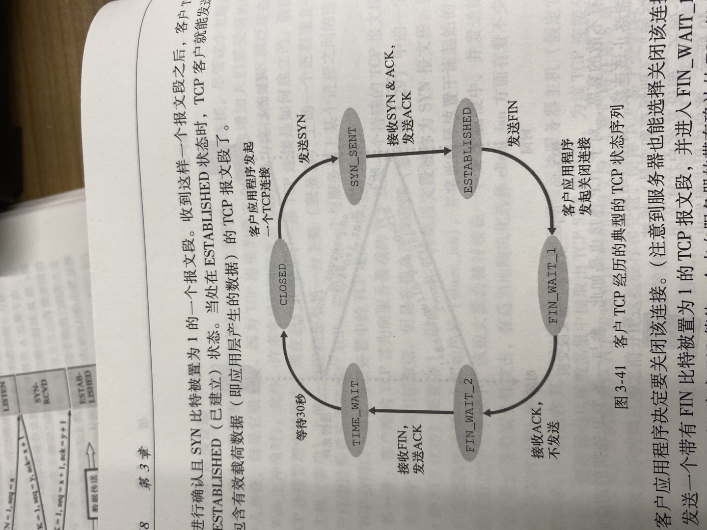
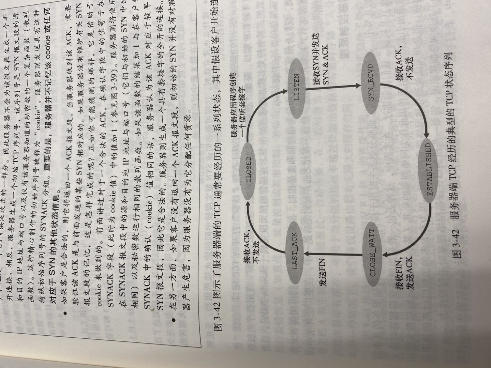
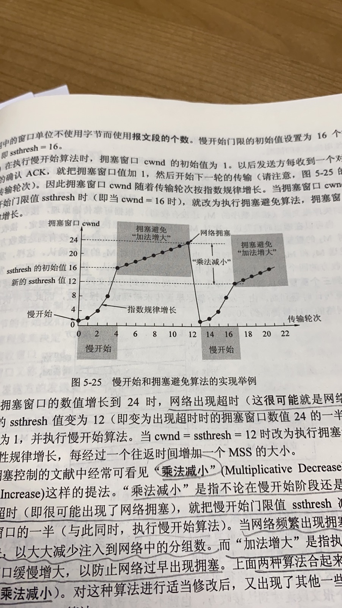
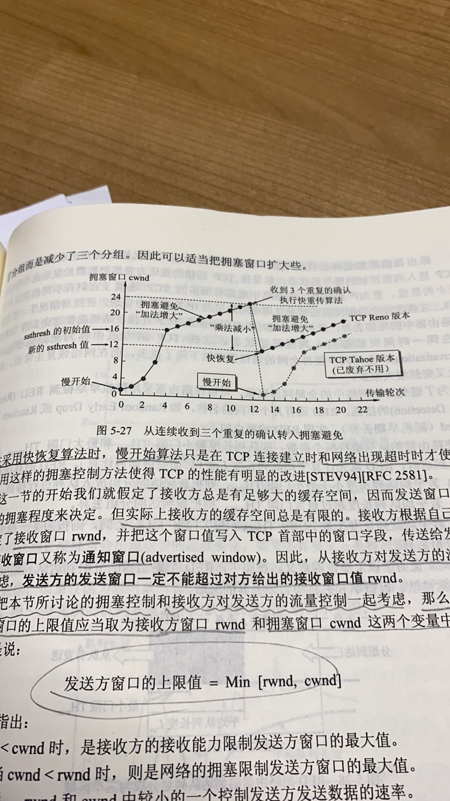

# 计算机网络

## 一 计算机网络模型五层

1. 应用层

   应用层是通过应用进程之间的交互来完成特定网络应用任务的。**应用层协议定义的是应用进程间通信和交互的规则**，不同的网络应用需要不同的应用层协议。互联网中应用层协议有很多，如域名系统DNS，支持万维网应用的HTTP协议，支持电子邮件的SMTP协议等等。

   - DNS协议
   - HTTP协议
   - SMTP协议

2. 传输层

   运输层为**应用进程之间提供端到端的逻辑通信，或者说负责向两台主机进程之间的通信提供通用的数据传输服务**。

   - 传输控制协议TCP，提供面向连接的，可靠的数据传输服务
   - 用户数据报协议UDP，提供无连接的，尽最大努力交付的数据传输服务

3. 网络层

   网络层为主机之间提供逻辑通信。在计算机网络中进行通信的两台计算机之间可能会经过很多个数据链路，也可能还要经过很多通信子网。网络层的任务就是选择合适的网间路由和交换节点，确保数据及时传送。

   - IP协议
   - ARP协议

4. 数据链路层

   两台主机之间的数据传输，总是在一段一段的链路上传送的，这就需要使用专门的链路层协议。在两个相邻节点之间传送数据时，数据链路层将网络层交下来的IP数据报组装成帧，在两个相邻节点间的链路上传送帧。

5. 物理层

   物理层的作用是实现相邻计算机节点之间比特流的透明传送，尽可能屏蔽掉具体传输介质和物理设备的差异。
   
   **该层为上层协议提供了一个传输数据的可靠的物理媒体。简单的说，物理层确保原始的数据可在各种物理媒体上传输**

## 二 TCP三次握手和四次挥手

TCP报文段结构:

源端口地址和目的端口地址用于多路复用/分解来自或送到上层应用的数据；

序号和确认号被TCP发送方和接收方用来实现可靠数据传输服务，序号是该报文段数据字段首字节的字节流编号，确认号是指到目前为止确认号之前的所有字节确保收到了，也可以认为是主机正在等待的数据的下一字节的序号——**累计确认**。

首部长度，4位表示32比特的字为单位的TCP首部长度，所以TCP首部最多60字节，常用的长度为20字节

标志字段，确认ACK比特指示该报文段是对已经成功接收报文段的确认，即确认号中的值是有效的；同步SYN和完成FIN比特用于连接建立和拆除；

接收窗口，用于流量控制，指示接收方愿意接收的字节数量

校验和字段，对头部和数据一起做校验

### 2.1 TCP三次握手

1. **连接请求报文段**，也称为SYN报文段：客户端的TCP向服务器端TCP发送SYN报文段，该报文段不包含应用程序数据，但是在报文段首部中的SYN标志位被置为1，此外客户端会随机选择一个初始序号x，放置到这条起始的TCP SYN报文段的序号字段中。(SYN = 1, seq = x)
2. **允许连接报文段**，也称为SYNACK报文段：一旦包含SYN报文段到达服务器并且成功接收后，服务器为该TCP连接分配TCP缓存和变量，并向该客户TCP发送SYNACK报文段。该报文段同样不包含应用程序数据，但是包含3个重要的信息，SYN比特将被置为1，其次该报文段首部的确认号字段被置为x+1，最后服务器选择自己的初始序号y，并将它放在TCP报文段首部的序号字段中。(SYN = 1, seq = y, ack = x+1)
3. 在收到SYNACK报文段后，客户也要给该连接分配缓存和变量。客户向服务器发送另一个报文段，对服务器发送的允许连接报文段进行了确认。(SYN = 0， ACK=1, seq = x+1, ack = y+1)

**注：为什么需要初始序号？为什么需要3次握手，而不是2次握手？**

- 为什么还需要第三次握手呢？主要是为了防止已失效的连接请求报文段突然又传送到了B，发生错误

**注：为什么要三次握手**

- 三次握手的目的是建立可靠的通信信道，说到通讯，简单来说就是数据的发送与接收，而三次握手最主要的目的就是双方确认自己与对方的发送与接收是正常的。

  第一次握手，第二次握手，第三次握手

### 2.2 TCP 四次挥手

1. 连接释放报文段，FIN报文段：A发送FIN报文段，然后停止发送数据，主动关闭TCP连接(FIN = 1, seq = u)
2. 释放确认报文段，ACK报文段：B收到连接释放报文段后即发出确认，这时服务器进程通知上层应用层进程，从A到B这个方向的连接就释放了(ACK=1, seq = v, ack = u+1)
3. 当B也没有数据需要发送时，其应用进程就通知TCP释放连接，发送FIN报文段(FIN=1, ACK = 1，seq = w, ack=u+1)
4. A收到B的连接释放报文段后，必须再次发送确认，该报文段（ACK = 1， seq = u+1, ack = w+1)。然后A进入时间等待状态，等待时间等待计时器设置的时间2MSL后，A才进入到CLOSED状态，连接正式关闭，客户端所有资源都释放。

**注:  为什么A必须在TIME-WAIT状态等待2MSL的时间呢，以及为什么需要2MSL的时间？**

- 因为第四次挥手即ACK报文段有可能丢失，如果丢失那么服务器就无法关闭连接。让TCP客户端保持2MSL时间，如果服务器没有收到ACK报文段，就会认为第三次挥手即FIN报文段丢失，它将重发，然后客户端将接收到FIN报文段，从而重发第四次挥手的ACK报文段，并且重新设置计时器的时间，直到这2MSL时间内没有收到FIN报文段，最后就将关闭连接。

### 2.3 TCP客户端和服务端的典型状态序列

### 2.4 TCP差错检验

UDP简介

## 三 TCP 协议如何保证可靠传输

1. 应用数据被分割成 TCP 认为最适合发送的数据块。 
2. TCP 给发送的每一个包进行编号，接收方对数据包进行排序，把有序数据传送给应用层。 
3. **校验和：** TCP 将保持它首部和数据的检验和。这是一个端到端的检验和，目的是检测数据在传输过程中的任何变化。如果收到段的检验和有差错，TCP 将丢弃这个报文段和不确认收到此报文段。 
4. TCP 的接收端会丢弃重复的数据。 
5. **流量控制：** TCP 连接的每一方都有固定大小的缓冲空间，TCP的接收端只允许发送端发送接收端缓冲区能接纳的数据。当接收方来不及处理发送方的数据，能提示发送方降低发送的速率，防止包丢失。TCP 使用的流量控制协议是可变大小的滑动窗口协议。 （TCP 利用滑动窗口实现流量控制）
6. **拥塞控制：** 当网络拥塞时，减少数据的发送。
7. **ARQ协议：** 也是为了实现可靠传输的，它的基本原理就是每发完一个分组就停止发送，等待对方确认。在收到确认后再发下一个分组。
8. **超时重传：** 当 TCP 发出一个段后，它启动一个定时器，等待目的端确认收到这个报文段。如果不能及时收到一个确认，将重发这个报文段。 

### 4.1 ARQ协议

**自动重传请求**（Automatic Repeat-reQuest，ARQ）是OSI模型中数据链路层和传输层的错误纠正协议之一。它通过使用确认和超时这两个机制，在不可靠服务的基础上实现可靠的信息传输。如果发送方在发送后一段时间之内没有收到确认帧，它通常会重新发送。ARQ包括停止等待ARQ协议和连续ARQ协议。

#### 停止等待ARQ协议

停止等待协议是为了实现可靠传输的，它的基本原理就是每发完一个分组就停止发送，等待对方确认（回复ACK）。如果过了一段时间（超时时间后），还是没有收到 ACK 确认，说明没有发送成功，需要重新发送，直到收到确认后再发下一个分组。

在停止等待协议中，若接收方收到重复分组，就丢弃该分组，但同时还要发送确认。

**优缺点：**

- **优点：** 简单
- **缺点：** 信道利用率低，等待时间长

**1) 无差错情况:**

发送方发送分组,接收方在规定时间内收到,并且回复确认.发送方再次发送。

**2) 出现差错情况（超时重传）:**

停止等待协议中超时重传是指只要超过一段时间仍然没有收到确认，就重传前面发送过的分组（认为刚才发送过的分组丢失了）。因此每发送完一个分组需要设置一个超时计时器，其重传时间应比数据在分组传输的平均往返时间更长一些。这种自动重传方式常称为 **自动重传请求 ARQ** 。另外在停止等待协议中若收到重复分组，就丢弃该分组，但同时还要发送确认。**连续 ARQ 协议** 可提高信道利用率。发送维持一个发送窗口，凡位于发送窗口内的分组可连续发送出去，而不需要等待对方确认。接收方一般采用累积确认，对按序到达的最后一个分组发送确认，表明到这个分组位置的所有分组都已经正确收到了。

**3) 确认丢失和确认迟到**

- **确认丢失** ：确认消息在传输过程丢失。当A发送M1消息，B收到后，B向A发送了一个M1确认消息，但却在传输过程中丢失。而A并不知道，在超时计时过后，A重传M1消息，B再次收到该消息后采取以下两点措施：1. 丢弃这个重复的M1消息，不向上层交付。 2. 向A发送确认消息。（不会认为已经发送过了，就不再发送。A能重传，就证明B的确认消息丢失）。
- **确认迟到** ：确认消息在传输过程中迟到。A发送M1消息，B收到并发送确认。在超时时间内没有收到确认消息，A重传M1消息，B仍然收到并继续发送确认消息（B收到了2份M1）。此时A收到了B第二次发送的确认消息。接着发送其他数据。过了一会，A收到了B第一次发送的对M1的确认消息（A也收到了2份确认消息）。处理如下：1. A收到重复的确认后，直接丢弃。2. B收到重复的M1后，也直接丢弃重复的M1。

#### 连续ARQ协议

连续 ARQ 协议可提高信道利用率。发送方维持一个发送窗口，凡位于发送窗口内的分组可以连续发送出去，而不需要等待对方确认。接收方一般采用累计确认，对按序到达的最后一个分组发送确认，表明到这个分组为止的所有分组都已经正确收到了。

**优缺点：**

- **优点：** 信道利用率高，容易实现，即使确认丢失，也不必重传。
- **缺点：** 不能向发送方反映出接收方已经正确收到的所有分组的信息。 比如：发送方发送了 5条 消息，中间第三条丢失（3号），这时接收方只能对前两个发送确认。发送方无法知道后三个分组的下落，而只好把后三个全部重传一次。这也叫 Go-Back-N（回退 N），表示需要退回来重传已经发送过的 N 个消息。

### 4.2 滑动窗口和流量控制

**TCP 利用滑动窗口实现流量控制。流量控制是为了控制发送方发送速率，保证接收方来得及接收。** 接收方发送的确认报文中的窗口字段可以用来控制发送方窗口大小，从而影响发送方的发送速率。将窗口字段设置为 0，则发送方不能发送数据。

### 4.3 拥塞控制

在某段时间，若对网络中某一资源的需求超过了该资源所能提供的可用部分，网络的性能就要变坏。这种情况就叫拥塞。拥塞控制就是为了防止过多的数据注入到网络中，这样就可以使网络中的路由器或链路不致过载。拥塞控制所要做的都有一个前提，就是网络能够承受现有的网络负荷。拥塞控制是一个全局性的过程，涉及到所有的主机，所有的路由器，以及与降低网络传输性能有关的所有因素。相反，流量控制往往是点对点通信量的控制，是个端到端的问题。流量控制所要做到的就是抑制发送端发送数据的速率，以便使接收端来得及接收。

为了进行拥塞控制，TCP 发送方要维持一个 **拥塞窗口(cwnd)** 的状态变量。拥塞控制窗口的大小取决于网络的拥塞程度，并且动态变化。发送方让自己的发送窗口取为拥塞窗口和接收方的接受窗口中较小的一个。

TCP的拥塞控制采用了四种算法，即 **慢开始** 、 **拥塞避免** 、**快重传** 和 **快恢复**。在网络层也可以使路由器采用适当的分组丢弃策略（如主动队列管理 AQM），以减少网络拥塞的发生。

- **慢开始：** 慢开始算法的思路是当主机开始发送数据时，如果立即把大量数据字节注入到网络，那么可能会引起网络阻塞，因为现在还不知道网络的符合情况。经验表明，较好的方法是先探测一下，即由小到大逐渐增大发送窗口，也就是由小到大逐渐增大拥塞窗口数值。cwnd初始值为1，每经过一个传播轮次，cwnd加倍。

- **拥塞避免：** 拥塞避免算法的思路是让拥塞窗口cwnd缓慢增大，即每经过一个往返时间RTT就把发送方的cwnd加1.

  

  

- **快重传与快恢复：**

  快重传算法要求接收方每收到一个**失序的报文段**就立即发出重复确认，而不必等待自己发送数据时才进行捎带确认。同时规定，发送方一连收到**三个重复确认**就应当立即重传对方尚未收到的报文段，而不必继续等待为该报文段设置的重传计时器到期。

  快恢复算法，当发送方连续收到三个重复确认时，就执行”乘法减少“算法，把慢开始门限ssthresh减半（这是为了预防网络发生拥塞），但接下来不执行慢开始算法；而是cwnd值设置为慢开始门限ssthresh减半后的值，然后执行拥塞避免算法。

  